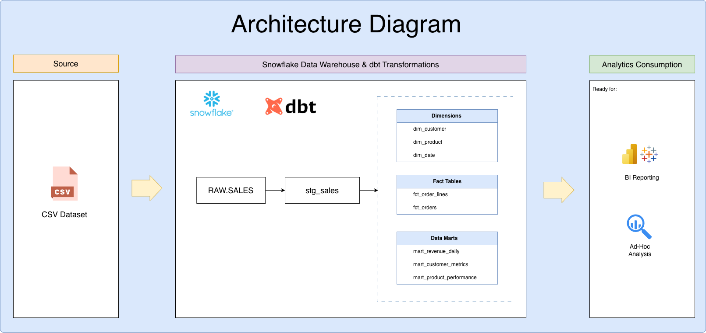
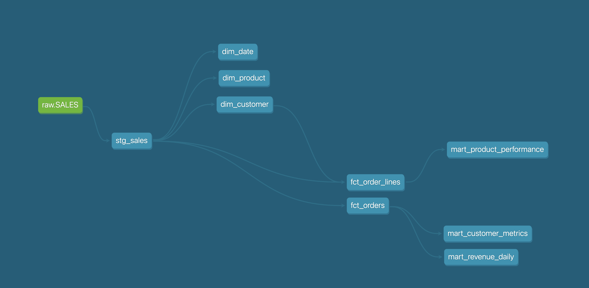
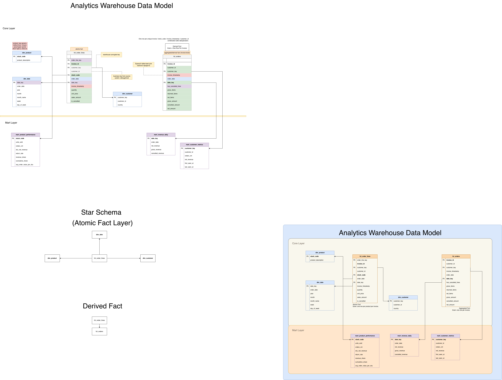
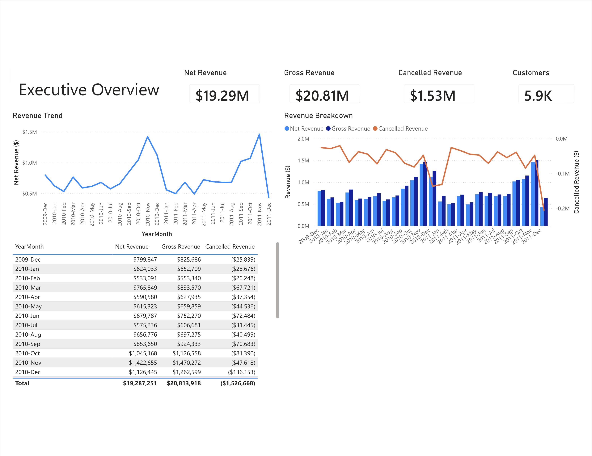
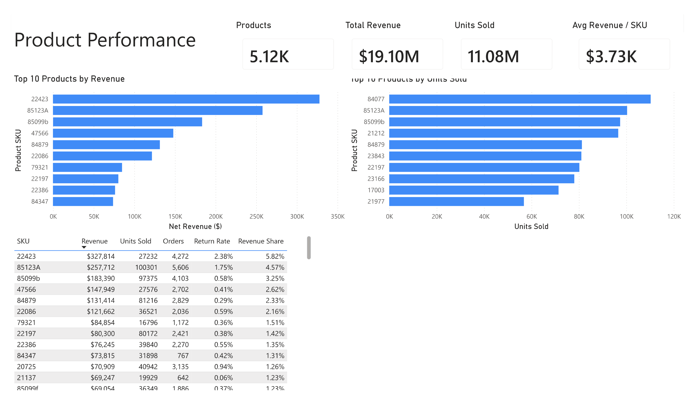

# Retail Analytics Warehouse

Snowflake • dbt • GitHub Actions • CI/CD

## 1. Business Scenario

A UK-based online retailer generates transactional sales data from its e-commerce platform.

The raw data contains:

- cancellations and returns
- duplicate order lines
- inconsistent structures
- limited analytical usability

Business teams require trusted datasets to support:

- revenue reporting
- customer analytics
- product performance analysis
- operational decision-making

The objective is to transform raw transactional data into a structured analytics warehouse using Snowflake and dbt, providing reliable datasets for reporting and business intelligence.

Dataset used:

Online Retail II dataset (sourced via Kaggle, originally published by the UCI Machine Learning Repository).

~1M e-commerce transactions from a UK-based online retailer.

---

## 2. Architecture Overview

The solution follows a modern dbt layered architecture.

### Architecture Diagram



### Staging Layer

Stores cleaned and standardized source data.

Responsibilities include:

- column normalization
- data type standardization
- basic data validation
- source column renaming

Model:

- `stg_sales`

### Core Analytical Layer

Implements the central analytical model using fact and dimension tables.

Tables:

- `fct_order_lines`
- `fct_orders`
- `dim_customer`
- `dim_product`
- `dim_date`

The core layer implements a dimensional model with shared dimensions, an atomic transaction-level fact table, and a derived invoice-level fact table.
This layer standardizes business entities and prepares data for analytical use.

### Data Mart Layer

Domain-specific analytical datasets for business teams.

Domains:

- finance
- marketing
- product

Tables:

- `mart_revenue_daily`
- `mart_customer_metrics`
- `mart_product_performance`

These datasets are optimized for BI reporting and analytical queries.

---

## 3. Data Flow

Source dataset contains:

- Invoice
- StockCode
- Description
- Quantity
- InvoiceDate
- UnitPrice
- CustomerID
- Country

Pipeline Flow:

Raw Sales Data

↓

Staging Layer (`stg_sales`)

↓

Core Models (`facts + dimensions`)

↓

Business Data Marts

↓

BI Reporting / Analytics

The pipeline transforms raw transactional records into structured analytical datasets ready for reporting and business analysis.

### dbt Model Lineage

The diagram below shows model dependencies and data flow across the dbt project.



---

## 4. Analytics Warehouse Data Model

The core model follows dimensional modeling principles with an atomic fact table, shared dimensions, and derived fact tables used for invoice-level analytics.

Fact tables store business events and measures.

Dimension tables provide business context used for filtering, grouping, and aggregation.

### Data Model Diagram




### Fact Table — `fct_order_lines`

**Grain:** One row per cleaned invoice line after duplicate sequencing.

Contains:

- quantity
- unit price
- sales amount
- cancellation indicator

References shared dimensions through:
- `customer_key`
- `date_key`
- `stock_code`

### Fact Table — `fct_orders`

`fct_orders` is a derived invoice-level fact table built from `fct_order_lines`.

**Grain:** One row per invoice.

Contains:

- gross items
- returned items
- net items
- gross revenue
- cancelled revenue
- net revenue

References shared dimensions through:
- `customer_key`
- `date_key`

### Dimension Tables

- dim_customer
- dim_product
- dim_date

Dimension design:

- `dim_customer` uses `customer_key` as the warehouse surrogate key and retains `customer_id` as the source business key.
- `dim_date` uses `date_key` (YYYYMMDD) as the analytical date key and retains `order_date` as the calendar date.
- `dim_product` uses `stock_code` as the product business key.

These dimensions support analysis across:

- customers
- products
- time

---

## 5. Analytical Data Marts

### Finance Mart — `mart_revenue_daily`

Daily financial metrics:

- gross revenue
- net revenue
- cancelled revenue

Used for:

- financial reporting
- revenue trend analysis

Primary analytical key:

- date_key

### Marketing Mart — `mart_customer_metrics`

Customer-level metrics:

- number of orders
- total revenue
- first purchase date
- last purchase date

Used for:

- customer analytics
- customer value analysis
- retention analysis

Primary analytical key:

- customer_key

### Product Mart — `mart_product_performance`

Product-level performance metrics:

- units sold
- order counts
- revenue share
- return rate
- cumulative revenue share

Used for:

- product performance analysis
- assortment optimization

---

## 6. Power BI Dashboard

The analytical warehouse is connected to Power BI for executive and product-level reporting.

### Executive Overview

Provides a high-level business performance view including:

- Net Revenue
- Gross Revenue
- Cancelled Revenue
- Customer Count
- Monthly Revenue Trends
- Revenue Breakdown Analysis



### Product Performance

Provides product-level performance analytics including:

- Top Revenue Products
- Top Selling Products
- Revenue Share Analysis
- Return Rate Analysis
- Product KPI Monitoring



---

## 7. Data Quality Controls

Data quality is implemented using dbt tests.

Controls include:

- not null validation
- uniqueness validation
- referential integrity validation
- relationship testing between fact and dimension tables

Examples:

- `not_null`
- `unique`
- `relationships`

Relationship tests validate:

- fct_order_lines.date_key → dim_date.date_key
- fct_order_lines.customer_key → dim_customer.customer_key
- fct_orders.date_key → dim_date.date_key
- fct_orders.customer_key → dim_customer.customer_key
- mart-level references to shared dimensions

These controls ensure consistency and integrity across the analytical model.

---

## 8. CI/CD Automation

The project uses GitHub Actions to automate validation and deployment workflows.

Pipeline definitions:

- `.github/workflows/dbt-ci.yml`
- `.github/workflows/dbt-cd.yml`

### Continuous Integration (CI)

CI validates project changes before deployment.

Typical validation steps:

- checkout repository
- setup Python
- install dbt-snowflake
- install dependencies
- dbt parsing and validation
- dbt test execution

### Continuous Deployment (CD)

CD runs automatically on push to the main branch.

Pipeline steps:

- checkout repository
- install dbt
- dbt deps
- dbt debug
- dbt build

This process automatically deploys the latest analytical models into Snowflake.

---

## 9. Snowflake Infrastructure Setup

The repository includes infrastructure setup scripts.

```text
infra/
└── init_snowflake.sql
```

The script creates:

- warehouse
- database
- schema
- roles
- permissions

Example components:

- `DBT_WH`
- `ANALYTICS`
- `RAW`
- `MART`

This makes the environment reproducible and easy to deploy.

---

## 10. Repository Structure

```text
retail-analytics-warehouse/

├── models
│
│   ├── staging
│   │   └── stg_sales.sql
│
│   └── marts
│       ├── core
│       │   ├── fct_order_lines.sql
│       │   ├── fct_orders.sql
│       │   ├── dim_customer.sql
│       │   ├── dim_product.sql
│       │   └── dim_date.sql
│
│       ├── finance
│       │   └── mart_revenue_daily.sql
│
│       ├── marketing
│       │   └── mart_customer_metrics.sql
│
│       └── product
│           └── mart_product_performance.sql
│
├── docs
│   ├── analytics_warehouse_data_model.png
│   ├── architecture_diagram.png
│   ├── dbt_lineage_full.png
│   ├──dashboard-executive-overview.png
│   └──dashboard-product-performance.png
│
├── macros
├── tests
├── infra
│   └── init_snowflake.sql
│
├── .github
│   └── workflows
│       ├── dbt-ci.yml
│       └── dbt-cd.yml
│
├── dbt_project.yml
└── README.md
```


---

## 11. Business Questions Answered

The analytical model supports answering questions such as:

- How does revenue change over time?
- Which products generate the highest revenue?
- Which products generate the highest sales volume?
- Which customers contribute the most revenue?
- How much revenue is lost through cancellations?
- What percentage of sales is returned or cancelled?
- What percentage of revenue is generated by top products?
- Which products have the highest return rates?
- How many active customers purchase each month?
- How does customer purchasing behavior evolve over time?

---

## 12. Technical Scope

### Data Modeling

- dimensional modeling
- star schema design
- surrogate keys
- fact and dimension tables

### Data Transformation

- dbt

### Data Warehouse

- Snowflake

### Automation

- GitHub Actions
- CI/CD pipelines

### Development Tools

- SQL
- Git
- GitHub

---

## 13. Technologies

- Snowflake
- dbt
- SQL
- Power BI
- Git
- GitHub Actions
- CI/CD
- Dimensional Modeling
- Data Visualization

---

## 14. Use Cases

This project demonstrates capabilities relevant for:

- Analytics Engineer
- Data Engineer
- Data Warehouse Developer
- BI Engineer
- SQL Developer

---

## 15. Project Outcomes

The solution delivers:

- standardized analytical datasets
- dimensional models optimized for reporting
- automated testing and deployment workflows
- reusable business-focused data marts

The project demonstrates practical Analytics Engineering workflows using Snowflake, dbt, SQL, Git, and GitHub Actions.

## 16. Key Skills Demonstrated

- Snowflake Data Warehouse Development
- dbt Data Transformations
- Dimensional Data Modeling
- Star Schema Design
- Fact and Dimension Modeling
- Data Quality Testing
- GitHub Actions CI/CD
- SQL Development
- Analytics Engineering Workflows
- Business Data Mart Development
- Power BI Dashboard Development
- KPI Design & Reporting
- Executive Reporting
- Product Performance Analytics
- Business Intelligence Visualization